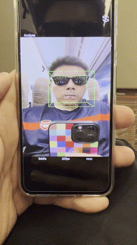
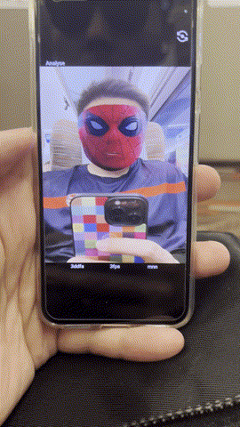
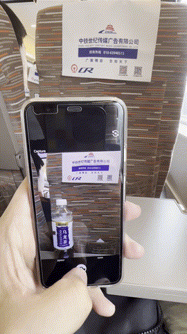

# aidb-android-demo

AiDB android demo.

<p align="center">
 
 
 
 
 
<p align="center">


## Tested Environment

* device: Google Pixel4
* Android: 13
  
## Prepare

* clone this rep

```agsl
git clone --recurse-submodules --shallow-submodules https://github.com/TalkUHulk/aidb_android_demo.git
```

* unzip [arm64-v8a.zip](https://github.com/TalkUHulk/aidb_android_demo/releases/download/v1.0/arm64-v8a.zip) and place it in app/libs

* place [config.zip](https://github.com/TalkUHulk/aidb_android_demo/releases/download/v1.0/config.zip) and [models.zip](https://github.com/TalkUHulk/aidb_android_demo/releases/download/v1.0/models.zip) in [assets](app/src/main/assets). 


